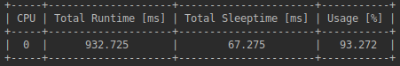
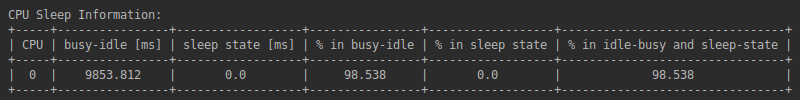
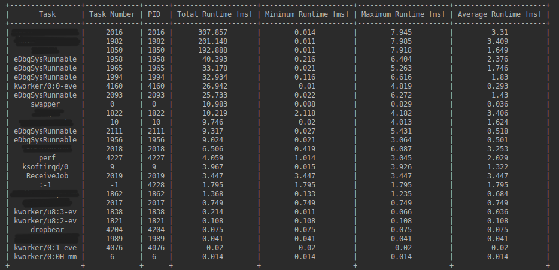
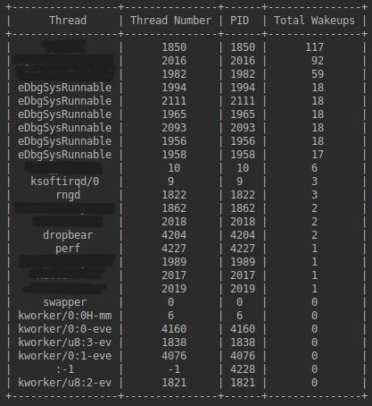
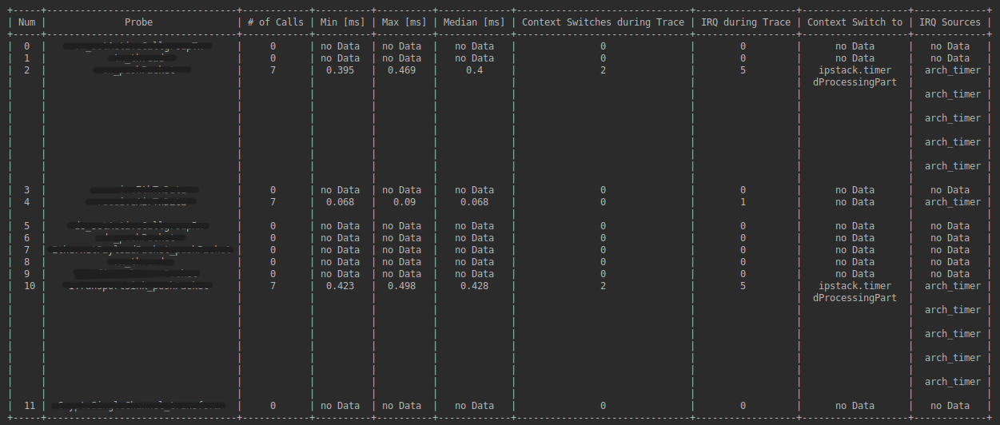
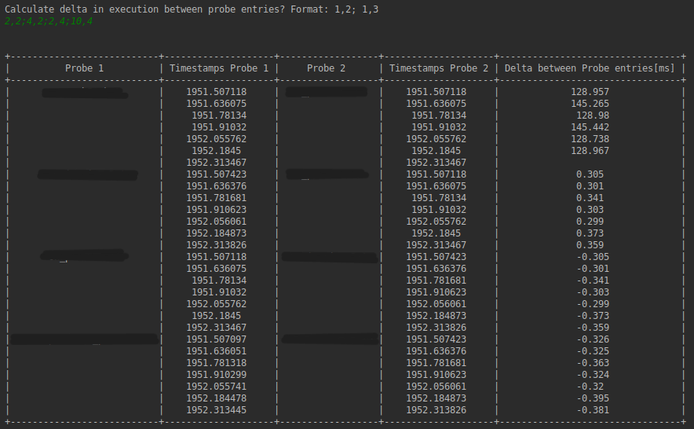
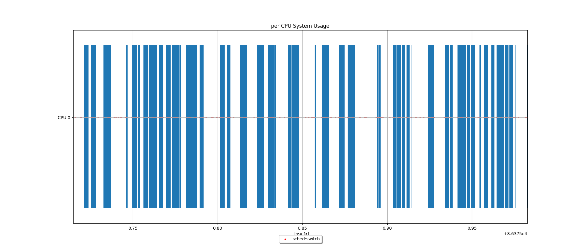
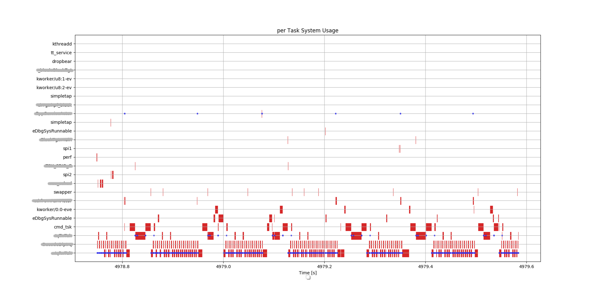

# perfViewer
## Installation
```shell
# download this package
git clone https://github.com/philipp-brandtner/perfViewer
cd ./perfViewer

# prettytable, paramiko, scp, matplotlib, pandas package is required
pip3 install prettytable paramiko scp matplotlib pandas
```

## Functionalities

- CPU Runtime Information:



- CPU Sleep Information



- Task Runtime Information:



- Task Sleep Information:



- Display Probe Data:



- Calculate time deltas between probes



- Graphically visualize cpu usage



- Graphically visualize task runtime with probe tracepoints



## Modes of Operation
- Online with tracing
- Online without tracing
- Offline with tracing
- Offline without tracing

## Online with/without Tracing
Load cpu, task and tracing data from target.
Before loading data, functions to trace need to be defined within specific probe file in probe_lists folder.
Each executable has its own probe file. Ex.: probes_tnw50_waveformblack.list for WaveformBlack

*probe.list Format:*
- EXECUTABLE             	... Name of executable
- PATH_TO_EXECUTABLE		... Path to executable

*Probe Example:*
MacControl::indSlotTick()

**Options to start perfViewer**
```console
python3 perfviewer.py -r --trace probe_lists/probes_tnw50_waveformblack.list -t 0.8
Connect to 192.168.24.200 and record data for 0.8 sec with probes from TNW50 WaveformBlack. Data is written to power-tools/SampleData*.

python3 perfviewer.py -b --trace probe_lists/probes_ff_redpayloadtgt.list -t 0.8 --overwrite
Connect to 192.168.24.201 and record data for 0.8 sec with probes from FF RedPayloadTgt. Data is written to power-tools/SampleData. Data in SampleData will be overwritten, if the folder exists.

python3 perfviewer.py -b --trace probe_lists/probes_tnw50_waveformblack.list -e ../executables/WaveformBlack
Don't download executable from target, but use WaveformBlack from ../executables/WaveformBlack

python3 perfviewer.py -b -t 0.8
Connect to 192.168.24.201 and record data for 0.8 sec without probes. Data is written to power-tools/SampleData*.
```
With * as the current time of the record.

**Calculate Time between probes**

After displaying of all probes defined in probe list, perfViewer gives the option to calculate time between probe execution. 

```console
Calculate delta in execution between probe entries? Format: 1,2; 1,3
```
The numbers can be found in the first column of the probe list in the console. 

Example: Calculate time difference between following funtions: 
func_1 - func_2
func_1 - func_3
--> Use Command: 1,2;1,3


**Output**

Output is generated in the console and following files are written to SampleData directory:
- Tracepoint.csv: Raw tracepoint runtime 
- Console_Output.csv: File with console data
- perf.data: Raw perf file. Use 'perf script' to display content 
- perf.data.sched:\*, perf.data.irq:\*, ...: Per event dumps
- Executables Ex.: WaveformControlRed: Executables to extract probe addresses

Probe data is also displayed in task usage overview.

## Offline with/without Tracing
Load data from directory and display in perfViewer.
```console
python3 perfviewer.py --offline ../SampleData --trace 
Use data from directory SampleData and activate tracing.

python3 perfviewer.py --offline ../SampleData_black_tx_10sec 
Use data from directory SampleData_black_tx_10sec without tracing.
```


